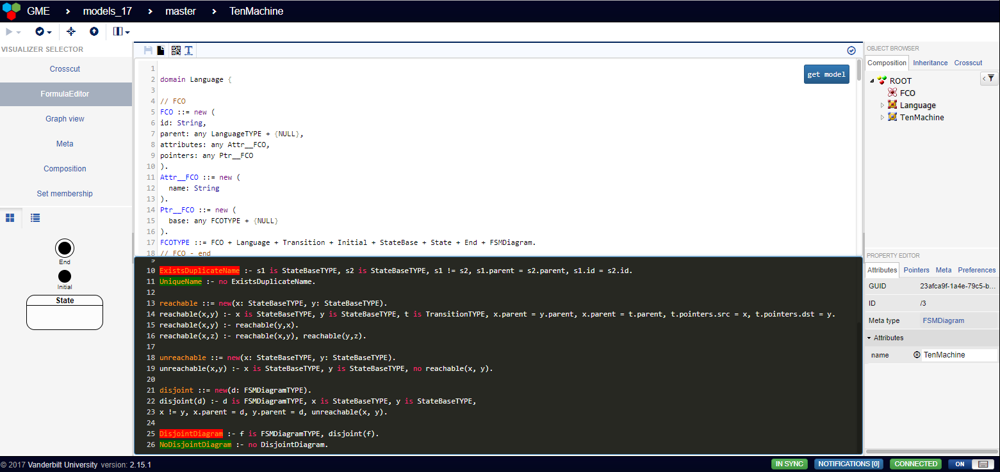

# Formula integration framework for WebGME
## More information on the components
[Formula](http://formula.codeplex.com/)
[WebGME](https://webgme.org)



## Installation (standalone):
As a prerequisite, you need to have [mongodb](https://www.mongodb.com), [nodejs](https://nodejs.org) (LTS) and [git](https://git-scm.com/) on the target deployment machine.
On linux based machines you will also need [Mono](http://www.mono-project.com) environment to run the Formula properly (See install Mono later).
Then you need to execute the following steps:
- ```git clone https://github.com/webgme/formula.git```
- ```git checkout gemoc17```
- ```git fetch -v --all```
- ```git git pull```
- ```npm install```
- ```npm install webgme```

### Installation of Mono on a linux based machine
Follow the instructions [described here](http://www.mono-project.com/docs/getting-started/install/linux/).
You can also simply try the apt-get if that is available:
- ```sudo apt-get install mono-complete```

## Configuration
- You can configure all the parameters offered by [WebGME](https://github.com/webgme/webgme/blob/master/config/README.md).
If you need to add your own configuration then it is best to pick a common environment name (which should be set for the NODE_ENV environment variable).
- Furthermore you can configure the formula machine's parameters
- Finally you need to change the ```component.json``` so that it contains the proper URL of the Formula machine:
```
{
  "FormulaEditor": {
    "baseUrl":"http://[your machines configured address]:[configured port of your formula machine]/4ml"
  }
}
```

## Execution
As this integration framework have two active component you need to run both to have the expected result:
- ```npm run start```
- ```npm run start_machine```

Either run them in background, or in two separate terminal threads. If you used the default configuration, the server
should be accessible at port 8888 [here](http://localhost:8888).

## Usage
The following will give some guidance on how to use the FormulaEditor visualizer. First if your project do not allow
it as a valid visualizer, then you have to configure it (or clean the given property field of your nodes, using the property editor).
Once it is allowed, you can switch to this special view. It does not matter where you are in the containment hierarchy as
the constraints you can write will be applied to the whole project and not just parts of it.
Here are the toolbar buttons that control the behaviour of the visualizer:
-  is for saving your constraints. Although they are automatically saved, whenever
you stop making changes for a certain amount of time.
-  controls if the screen should visualize the synchronously available
Formula domain. If this and the constraint editor is also visualized, then a fixed split screen will be shown (upper portion is
the domain and the lower is the editor).
-  controls if the constraint editor should be shown on
the screen. As some portion of code editing must be visible, either the constraint editor or the Formula domain will be
seen all the time.
-  opens up the model transformation view. Currently the
visuals are only a mockup as the functionality is not yet implemented.
- There is a status icon on the right of the toolbar that can have multiple states:
 - If no icon is shown, then the status is OK.
 -  shows that there is a communication error
 between the WebGME server and the Formula machine. If not resolves with the next commit, server log files should be
 checked.
 -  tells that the client is currently waiting for the latest results.
 